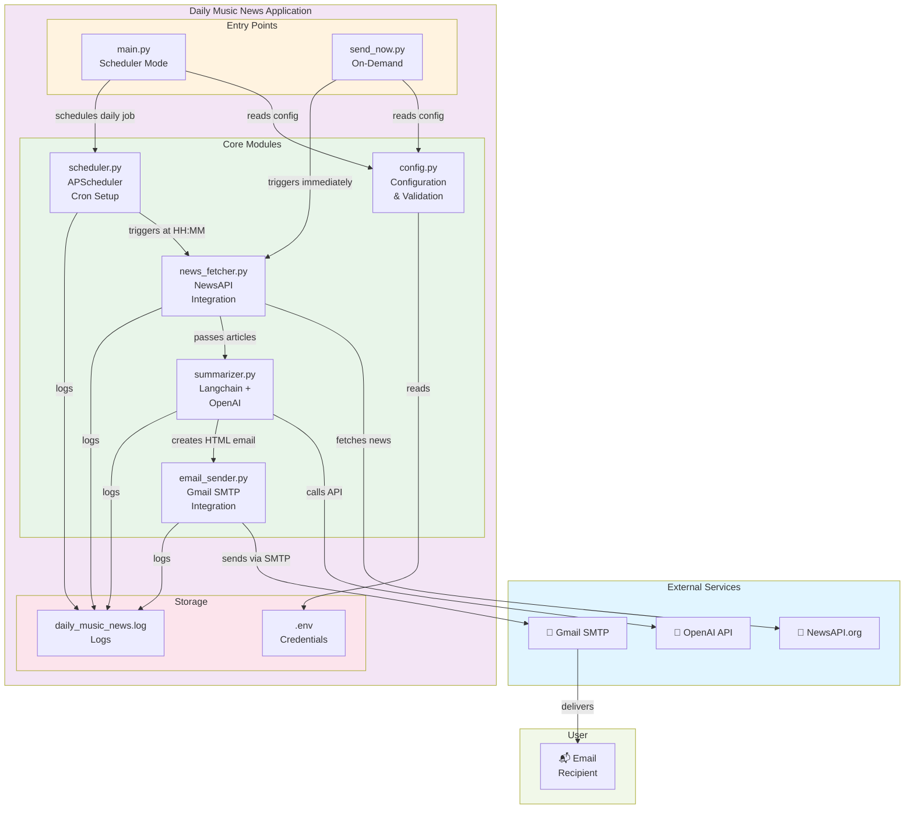

# 🏗️ Daily Music News - Architecture

## System Overview



---

## Component Architecture

### 📍 Entry Points

#### **main.py** - Scheduler Mode
- Runs the application with daily scheduling
- Validates configuration on startup
- Initializes APScheduler with cron trigger
- Keeps running to listen for scheduled events
- Accepts `--send-now` flag for immediate sends

```
Usage: python main.py
       python main.py --send-now
       python main.py -s
```

#### **send_now.py** - On-Demand Mode
- Sends digest immediately without scheduling
- Perfect for testing and manual sends
- Exits after sending
- No background scheduler needed

```
Usage: python send_now.py
```

---

### 🔧 Core Modules

#### **config.py** - Configuration Management
**Responsibilities:**
- Load environment variables from `.env`
- Validate all required credentials are set
- Provide centralized configuration access
- Raise errors if config is incomplete

**Key Variables:**
```python
OPENAI_API_KEY        # OpenAI authentication
NEWSAPI_KEY          # NewsAPI authentication
GMAIL_ADDRESS        # Gmail sender
GMAIL_APP_PASSWORD   # Gmail app password
RECIPIENT_EMAIL      # Email recipient
SCHEDULE_TIME        # Daily send time (HH:MM)
MODEL_NAME           # LLM model (default: gpt-3.5-turbo)
```

#### **news_fetcher.py** - NewsAPI Integration
**Class:** `NewsAPIFetcher`

**Methods:**
- `fetch_music_news(query, limit)` - Fetch articles from NewsAPI
- `format_articles(articles)` - Convert articles to readable text

**Data Flow:**
```
NewsAPI.org ← (HTTP GET) ← fetch_music_news()
    ↓
Article JSON
    ↓
format_articles()
    ↓
Formatted text (ready for summarization)
```

#### **summarizer.py** - Langchain + OpenAI
**Class:** `NewsSummarizer`

**Technology Stack:**
- LangChain Expression Language (LCEL)
- OpenAI ChatGPT
- PromptTemplate for structured prompts

**Methods:**
- `summarize(articles_text)` - Generate summary via OpenAI
- `create_email_body(summary)` - Create styled HTML email

**Pipeline:**
```
Formatted Articles
    ↓
PromptTemplate (LCEL)
    ↓
ChatOpenAI (gpt-3.5-turbo)
    ↓
Summary Text
    ↓
HTML Email Body
```

#### **email_sender.py** - Gmail Integration
**Class:** `GmailSender`

**Methods:**
- `send_email(recipient, subject, body_html, body_text)` - Send via SMTP
- `send_music_news_digest(summary_html)` - Send digest with formatting

**Protocol:** SMTP with TLS
- Server: `smtp.gmail.com`
- Port: `587`
- Auth: Gmail App Password

#### **scheduler.py** - APScheduler Setup
**Class:** `NewsScheduler`

**Methods:**
- `schedule_daily_news(job_func, hour, minute)` - Schedule cron job
- `start()` - Start background scheduler
- `stop()` - Stop scheduler
- `get_next_run()` - Get next execution time

**Implementation:**
- Background scheduler (non-blocking)
- CronTrigger for daily execution
- Configurable time via `SCHEDULE_TIME` env var

---

## 📊 Data Flow Diagrams

### Scheduler Mode Flow (main.py)

```
┌─────────────────────────┐
│   python main.py        │
└────────────┬────────────┘
             │
             ↓
     ┌──────────────────┐
     │ Load Config (.env)│
     └────────┬─────────┘
              │
              ↓
     ┌──────────────────┐
     │ Start Scheduler  │ ← APScheduler
     └────────┬─────────┘
              │
              ↓ (Waits until 08:00)
              │
              ↓
     ┌──────────────────┐
     │ Trigger Job      │ (Daily at HH:MM)
     └────────┬─────────┘
              │
              ├─→ news_fetcher.py
              │   ↓
              │   NewsAPI.org
              │   ↓ Articles
              │
              ├─→ summarizer.py
              │   ↓
              │   OpenAI API
              │   ↓ Summary
              │
              ├─→ email_sender.py
              │   ↓
              │   Gmail SMTP
              │   ↓
              ↓   jdrpuche@gmail.com
        ┌──────────────┐
        │   📧 Inbox   │
        └──────────────┘
```

### On-Demand Mode Flow (send_now.py)

```
┌──────────────────────┐
│ python send_now.py   │
└──────────┬───────────┘
           │
           ↓
   ┌───────────────────┐
   │ Load Config (.env)│
   └────────┬──────────┘
            │
            ↓
   ┌────────────────────────────────────┐
   │ Fetch → Summarize → Email → Exit   │
   └────────────────────────────────────┘
            │
            ├─→ News fetched
            ├─→ Summary generated
            ├─→ Email sent
            ↓
        Exit (0)
```

---

## 🗂️ File Structure

```
daily_music_news/
│
├── 🔴 Entry Points
│   ├── main.py              (Scheduler + on-demand)
│   └── send_now.py          (On-demand only)
│
├── 🟢 Core Modules
│   ├── config.py            (Configuration management)
│   ├── news_fetcher.py      (NewsAPI integration)
│   ├── summarizer.py        (Langchain + OpenAI)
│   ├── email_sender.py      (Gmail SMTP)
│   └── scheduler.py         (APScheduler)
│
├── ⚙️ Configuration
│   ├── .env                 (Credentials - git-ignored)
│   ├── .env.example         (Template)
│   ├── pyproject.toml       (Dependencies)
│   └── .gitignore           (Git rules)
│
├── 📚 Documentation
│   ├── README.md            (Full documentation)
│   ├── GETTING_STARTED.md   (Quick start)
│   ├── SETUP_GUIDE.md       (Setup instructions)
│   ├── ON_DEMAND.md         (On-demand usage)
│   ├── PROJECT_SUMMARY.md   (Overview)
│   └── ARCHITECTURE.md      (This file)
│
├── 🐍 Virtual Environment
│   └── .venv/               (Python packages)
│
└── 📝 Logs & Runtime
    └── daily_music_news.log (Application logs)
```

---

## 🔌 External API Integrations

### NewsAPI.org
**Endpoint:** `https://newsapi.org/v2/everything`

**Request Parameters:**
```python
{
    "q": "music",
    "language": "en",
    "sortBy": "publishedAt",
    "apiKey": NEWSAPI_KEY,
    "pageSize": 10
}
```

**Response:** JSON array of articles

### OpenAI API
**Model:** `gpt-3.5-turbo` (customizable)

**Request:**
```python
ChatMessage(
    role="user",
    content="Summarize these music news articles..."
)
```

**Response:** Generated summary text

### Gmail SMTP
**Server:** `smtp.gmail.com:587`
**Protocol:** TLS
**Auth:** Email + App Password

**Email Format:**
- Multipart (text + HTML)
- HTML includes CSS styling
- Beautiful gradient header

---

## 🔐 Security Architecture

### Credential Management
- All sensitive data in `.env` (git-ignored)
- No hardcoded secrets in code
- Environment variable loading via `python-dotenv`

### Gmail Security
- Uses app-specific passwords (not main Gmail password)
- TLS encryption for SMTP
- No credentials stored in logs

### API Keys
- Loaded at runtime only
- Never printed to logs
- Validated at startup

---

## 🚀 Execution Paths

### Path 1: Daily Scheduled (main.py)
```
Initialize
  ↓
Load Config
  ↓
Validate Credentials
  ↓
Start APScheduler
  ↓
Wait for scheduled time (08:00)
  ↓
Execute send_daily_digest()
  ↓
Repeat tomorrow
```

### Path 2: On-Demand (send_now.py)
```
Initialize
  ↓
Load Config
  ↓
Validate Credentials
  ↓
Execute send_digest_now()
  ↓
Exit
```

### Path 3: Main with Flag (main.py --send-now)
```
Initialize
  ↓
Load Config
  ↓
Check for --send-now flag
  ↓
Execute send_daily_digest()
  ↓
Exit
```

---

## 🧬 Technology Stack

| Component | Technology | Version |
|-----------|-----------|---------|
| Language | Python | 3.9+ |
| Package Manager | UV | Latest |
| Virtual Env | venv | Built-in |
| Scheduling | APScheduler | 3.11+ |
| LLM Framework | Langchain | 1.3+ |
| LLM Provider | OpenAI API | gpt-3.5-turbo |
| News Source | NewsAPI | REST API |
| Email | Gmail SMTP | TLS 587 |
| HTTP Client | Requests | 2.31+ |
| Config | python-dotenv | 1.0+ |

---

## 📈 Scaling Considerations

### Current Limitations
- Single-threaded execution
- No database (logs only)
- No caching of articles
- Single recipient

### Potential Improvements
- **Database:** Store articles history
- **Cache:** Avoid duplicate sends
- **Queuing:** Use Celery for async tasks
- **Multiple Recipients:** Support mailing lists
- **Multi-language:** Translate summaries
- **Custom Topics:** Per-recipient news categories
- **Analytics:** Track engagement

---

## 🔍 Monitoring & Logging

### Log Levels
- INFO: Normal operation (default)
- WARNING: Recoverable issues
- ERROR: Failed operations

### Log Destinations
1. **Console:** Real-time output
2. **File:** `daily_music_news.log` (persistent)

### Logged Events
- Configuration validation
- API calls (fetch, summarize, send)
- Email delivery status
- Errors and exceptions

**View logs:**
```bash
# Real-time
tail -f daily_music_news.log

# Errors only
grep ERROR daily_music_news.log

# Today's activity
grep "2026-05-25" daily_music_news.log
```

---

## 🎯 Key Design Decisions

1. **Modular Architecture:** Each component has single responsibility
2. **Configuration-Driven:** All settings in `.env`
3. **Dual Entry Points:** Flexibility for scheduled + on-demand
4. **Langchain LCEL:** Modern, composable LLM chains
5. **Logging:** Comprehensive for debugging
6. **Error Handling:** Graceful degradation
7. **No Database:** Simplicity over persistence

---

## 📞 Dependency Graph

```
main.py / send_now.py
    ↓
config.py (loads .env)
    ↓
├─→ news_fetcher.py (uses requests)
│       ↓
│       requests → NewsAPI
│
├─→ summarizer.py (uses langchain)
│       ↓
│       langchain-openai → OpenAI
│
├─→ email_sender.py (uses smtplib)
│       ↓
│       smtplib → Gmail
│
└─→ scheduler.py (uses apscheduler)
        ↓
        apscheduler → Background scheduling
```

---

**Generated:** May 25, 2026
**Last Updated:** Daily Music News v0.1.0
